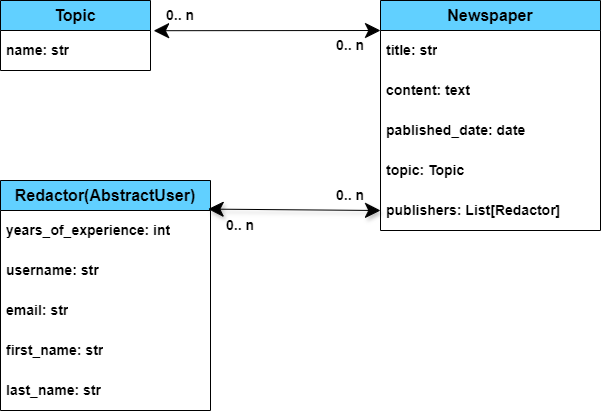
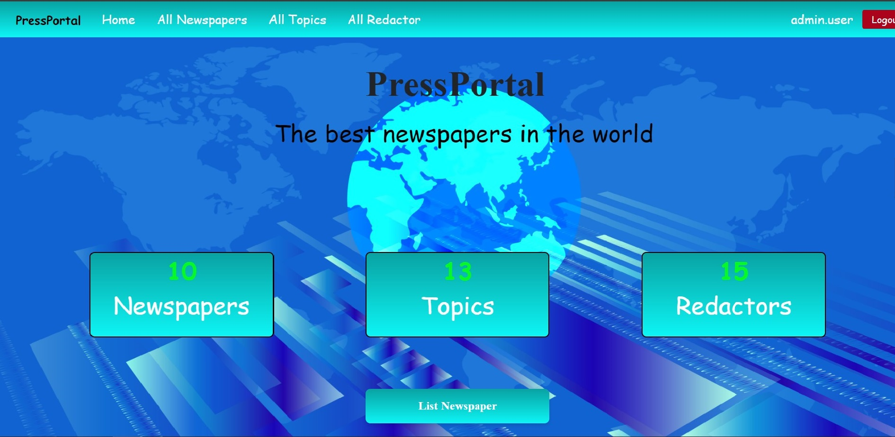

# Press Portal

Press Portal - a system to track editors and publishers of newspapers within a newspaper agency, ensuring proper
accountability and management of the team's work.

## Check Out

[Press Portal project deployed on Render](https://press-portal.onrender.com)

## Features
1. Newspaper Creation
Easy Newspaper Creation: Redactors can create newspapers by providing a title and content, making it simple to start new
publications.
2. Redactor Assignment
Assign Redactors: Easily assign redactors to newspapers, ensuring that each publication has a dedicated team.
3. Topic Management
Manage Topics: Organize newspapers by topics, allowing for categorization and easy retrieval of specific types of
content.
4. Collaboration
Enhanced Collaboration: Facilitate collaboration among redactors by allowing them to work together on newspapers, share
updates, and communicate effectively.
5. Experience Tracking
Track Redactor Experience: Maintain records of redactors' years of experience, ensuring that the most experienced team
members are assigned to appropriate tasks.

## DB schema



## Installation

1. Clone the repository to your local machine:

```bash
git clone https://github.com/saywin/press-portal.git
```

2. Create a virtual environment:

```bash
python -m venv venv
```

3. Activate the virtual environment:

On Windows:

```bash
venv\Scripts\activate
```

On Mac:

```bash
source venv/bin/activate
```

4. Install dependencies

```bash
pip install -r requirements.txt
```

5. Perform database migrations:

```bash
python manage.py migrate
```

6. Run the development server:

```bash
python manage.py runserver
```

## Usage

1. Log in to the Press Portal using the provided credentials.
2. Navigate to the admin panel (http://127.0.0.1:8000/admin) to manage newspaper types, newspapers, and redactors.
3. Create newspaper types according to your agency's requirements.
4. Create redactors to enable them to log in to the system.
5. Redactors create newspapers and assign themselves to these newspapers.
6. Redactors can log in to the application to view and update the status of their newspapers and mark them as published.

## Technologies used

1. Django: A high-level Python web framework that encourages rapid development and clean, pragmatic design.
2. HTML/CSS: Standard markup and styling languages used for creating the application's user interface.
3. Bootstrap: A front-end framework for developing websites.
4. SQLite: A lightweight relational database management system used for storing application data during development and
   testing.
5. Django Testing Framework: Built-in testing framework provided by Django, including TestCase for writing unit tests.

## Main page of the site
